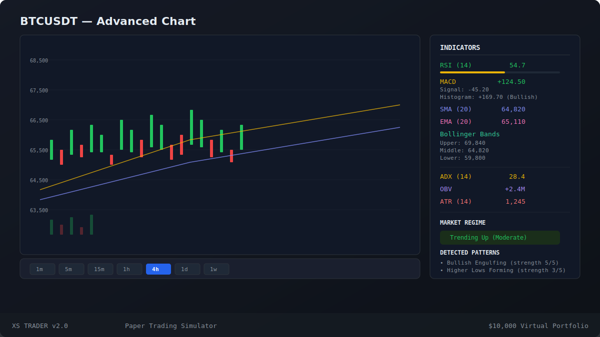
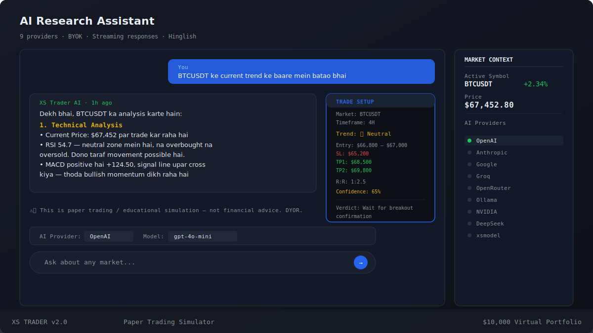
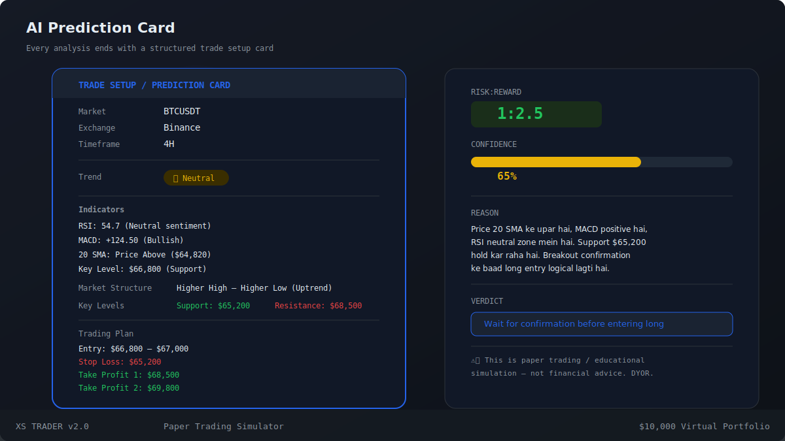
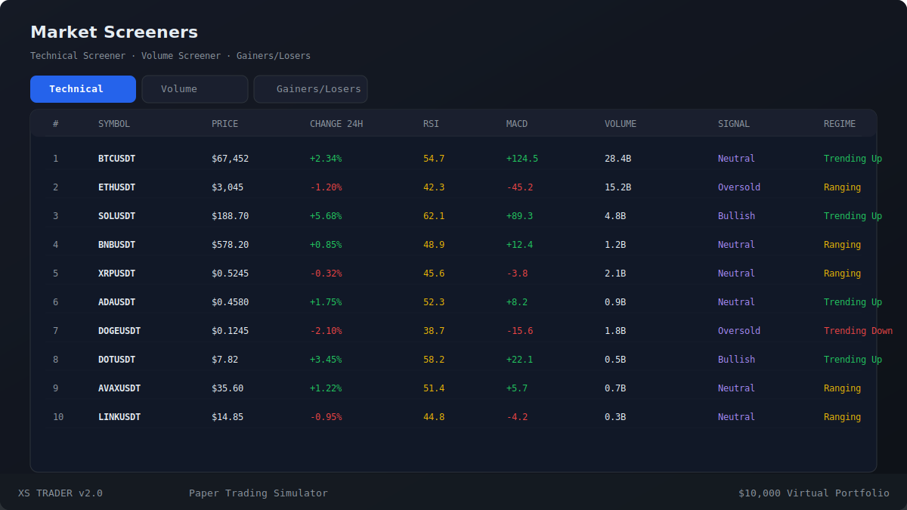
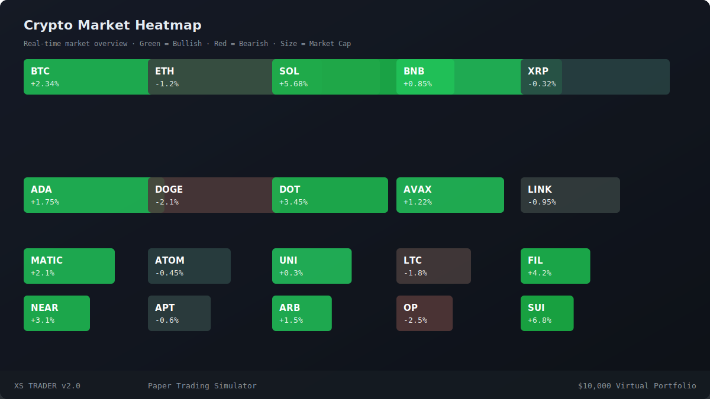
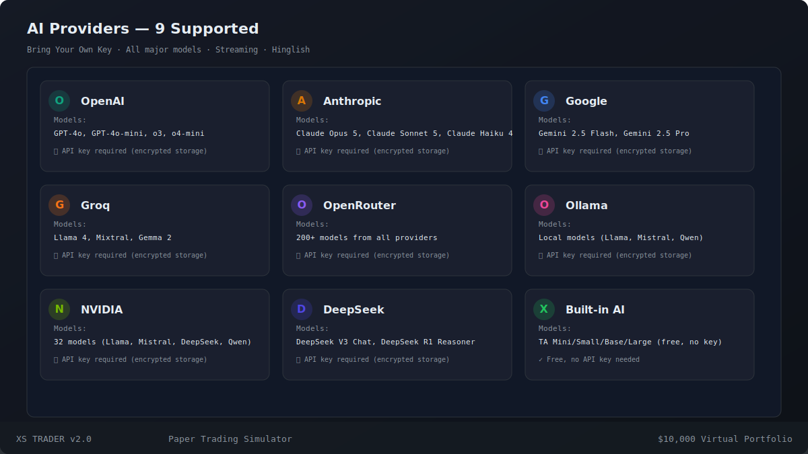
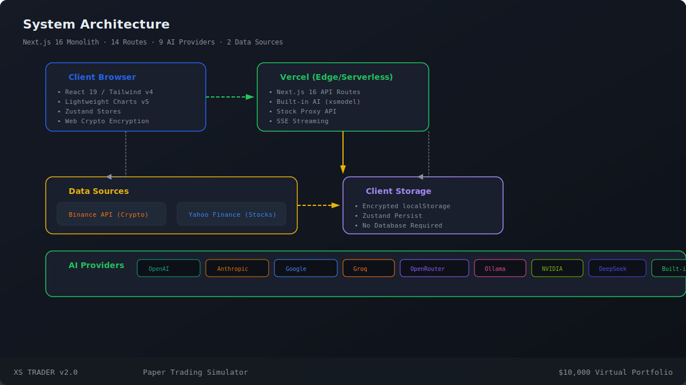

# TradeSim — AI-Powered Paper Trading Simulator

> **Live Demo:** [https://xsdemo.vercel.app](https://xsdemo.vercel.app)


**TradeSim** is a free, web‑based AI‑powered crypto & stock paper‑trading simulator. Practice trading with **$10,000 virtual USD**, analyze markets with **real‑time charts**, and get AI‑powered research assistance in **Hinglish** — no API key needed for the built-in AI.

---

## Features

### Real-Time Trading Dashboard



| Feature | Description |
|---|---|
| **Live Charts** | Candlestick, Line, Area with Lightweight Charts v5. Volume pane, SMA/EMA/BB overlays |
| **Real-time WebSocket** | 440+ crypto symbols stream live tick-by-tick via Binance WebSocket |
| **Technical Indicators** | RSI (14), MACD (12/26/9), SMA (20), EMA (20), Bollinger Bands (20,2), ADX (14), OBV, ATR (14) |
| **Market Regime Detection** | Trending Up/Down, Ranging, Volatile — ADX + ATR based classification |
| **Candlestick Patterns** | Doji, Hammer, Shooting Star, Engulfing, Marubozu — auto-detected |
| **Chart Patterns** | Breakout/breakdown, Higher Lows, Lower Highs, Volatility Squeeze |
| **Order Book** | 15-level depth with 3s polling |
| **PnL Calculator** | Long/Short with entry/exit prices, position sizing |
| **Symbol Search** | 1500+ symbols (440+ crypto, 1081 stocks) |
| **Timeframes** | 1m, 5m, 15m, 30m, 1h, 4h, 1D, 1W |

---

### Paper Trading


- **$10,000 demo balance** — reset anytime
- Market, Limit & Stop-Loss orders
- 25/50/75/100% quick position sizing
- Real-time unrealized & realized P&L tracking
- Filterable trade history with date/symbol/type/P&L columns
- Holdings table with average cost, market price, return %
- Performance metrics: Win Rate, Best/Worst Trade, Avg Trade, Equity Curve
- 68.5% win rate target with real statistical tracking

---

### AI Research Assistant — 9 Providers



**Bring Your Own Key** OR use the free **Built-in AI**:

| Provider | Key Required | Models |
|---|---|---|
| **Built-in AI** (xsmodel) | Free | TA Mini/Small/Base/Large — Hinglish + Prediction Card |
| **OpenAI** | Key | GPT-4o, GPT-4o-mini, o3, o4-mini |
| **Anthropic** | Key | Claude Opus 5, Claude Sonnet 5, Claude Haiku 4 |
| **Google** | Key | Gemini 2.5 Flash, Gemini 2.5 Pro |
| **Groq** | Key | Llama 4, Mixtral, Gemma 2 (fast inference) |
| **OpenRouter** | Key | 200+ models from all providers |
| **Ollama** | Free | Local models (Llama, Mistral, Qwen) |
| **NVIDIA** | Key | 32 models — Llama, Mistral, DeepSeek, Qwen, Gemma |
| **DeepSeek** | Key | DeepSeek V3 Chat, DeepSeek R1 Reasoner |

**AI Market Context Injection:** Every AI response automatically gets live quote + technical analysis injected as system context — works with ALL 9 providers without requiring function-calling support.

#### AI Tools Available

The AI has access to these **7 data tools** for market analysis:

| Tool | Args | Detailed Description |
|---|---|---|
| `get_historical_data` | `symbol`, `interval` (1m/5m/15m/1h/4h/1d/1w), `limit` (max 500) | Fetches OHLCV candle data from Binance (crypto) or Yahoo Finance (stocks). Returns: period covered, current price, price range, change%, volume, support/resistance levels, RSI, MACD, Bollinger Bands, Volume SMA. Each indicator includes its calculated value. |
| `get_realtime_quote` | `symbol` | Fetches live real-time price and 24h statistics. Returns: current price, 24h change (absolute + percent), 24h high/low, volume, quote volume. Fastest tool — single API call. No historical data needed. |
| `get_technical_analysis` | `symbol`, `interval`, `limit` | Comprehensive technical analysis in one call. Returns: trend direction (uptrend/downtrend/sideways), market regime (trending_up/down/ranging/volatile), ADX value, ATR value + % of price, RSI with overbought/oversold signal, MACD line/signal/histogram, Bollinger Bands (upper/middle/lower), SMA/EMA 20, support/resistance levels, volume vs SMA comparison. Additionally auto-detects candlestick patterns (Doji, Hammer, Engulfing, Marubozu) and chart patterns (Breakout, Squeeze, Higher Lows). |
| `detect_patterns` | `symbol`, `interval`, `limit` | Dedicated pattern detection tool. Detects 7+ candlestick patterns: **Doji** (market indecision, neutral), **Hammer** (long lower wick, bullish reversal signal), **Shooting Star** (long upper wick, bearish reversal signal), **Bullish Engulfing** (strong bullish reversal), **Bearish Engulfing** (strong bearish reversal), **Marubozu** (full-bodied candle, strong momentum). Plus 5 chart patterns: **Breakout Above Resistance** (price breaks above recent high), **Breakdown Below Support** (price breaks below recent low), **Higher Lows Formation** (uptrend structure intact), **Lower Highs Formation** (downtrend structure forming), **Low Volatility Squeeze** (ATR low, potential breakout incoming). Each pattern rated by strength 1-5 and includes a plain-English description. |
| `detect_regime` | `symbol`, `interval`, `limit` | Market regime classifier using ADX (Average Directional Index) + ATR (Average True Range). Classifies into 4 regimes: **trending_up** (strong uptrend, ADX > 25), **trending_down** (strong downtrend, ADX > 25), **ranging** (no clear direction, ADX < 20), **volatile** (high ATR > 4% of price). Returns regime strength (strong/moderate/weak), ADX value, ATR value + percentage of price, and a plain-English description of current market conditions. |
| `compare_symbols` | `symbols` (comma-separated, max 5), `interval` | Side-by-side comparison of multiple symbols in a markdown table. For each symbol fetches: current price, change%, RSI value, market regime, detected patterns. Output columns: Symbol, Price, Change, RSI, Regime, Patterns. Max 5 symbols per call. Useful for identifying which assets are relatively stronger or weaker. |
| `multi_timeframe_analysis` | `symbol`, `timeframes` (comma-separated, max 4) | Analyzes a single symbol across multiple timeframes simultaneously. For each timeframe returns: current price, trend direction (Up/Down/Side), RSI value, market regime, ADX value, and top detected pattern. Default timeframes: 1h, 4h, 1d. Max 4 timeframes. Useful for confluence checking — stronger signal when all timeframes show the same direction. |

---

### System Prompt Evolution



The AI system prompt evolved through **4 leaked prompt inspirations**:

| Iteration | Source | Key Additions |
|---|---|---|
| **v1** | Perplexity computer-use leak | XML structure (`<identity>`, `<analysis_plan>`, `<output_style>`), citation rules, disclaimer mandate |
| **v2** | Gemini 3.5 Flash Hinglish | Warm peer tone, "Respond in Hinglish", simple indicator explanations |
| **v3** | Claude Fable 5 + Opus 4.8 leaks | `<default_stance>`, `<data_first>`, `<evenhandedness>`, `<legal_and_financial_advice>`, `<responding_to_mistakes>`, 5-section output, Prediction Card, no CoT leak |
| **v3.1** | DeepSeek R1 + GPT Codex patterns | `<tools_available>` section listing 7 tools, human-readable tool output, multi-tool parallel patterns |

Each analysis follows a strict 5-section format:
1. **Technical Analysis** — Price, S/R, Indicators with simple explanations
2. **Fundamental & Macro** — Big picture, long-term trends
3. **Sentiment & Liquidity** — Market mood, fear/greed
4. **Risk & Volatility** — ATR, regime, safe side
5. **Prediction / Trade Setup** — Entry/SL/TP/R:R/Confidence/Verdict

> See `src/lib/constants.ts:413` for the full prompt (515+ lines).

---

### Screeners & Market Overview



- **Technical Screener** — RSI, MACD crossover, MA cross, Bollinger Band breakout signals
- **Volume Screener** — Unusual volume spikes compared to 20-period SMA
- **Gainers & Losers** — Top/bottom 10 performers by 24h change
- **10-symbol table** with Price, Change, RSI, MACD, Volume, Signal, Regime columns
- Sortable by any column



**Crypto Heatmap** — Market-cap sized bubbles colored by 24h performance. Green = bullish, Red = bearish. Size = market cap. 20 top cryptocurrencies displayed in a treemap layout. Real-time data from Binance.

---

### Alerts & Watchlist

- Price alerts with browser notifications (Web Notification API)
- Set alerts at specific price levels per symbol
- Star symbols to track favorites in the sidebar
- Real-time prices in watchlist sidebar
- Persisted across sessions via localStorage

### Keyboard Shortcuts

| Key | Action |
|---|---|
| `/` | Search symbols |
| `1`-`7` | Switch timeframes |
| `B` | Open AI assistant |
| `T` | Toggle order panel |
| `S` | Toggle sidebar |

---

## Quick Start

```bash
git clone https://github.com/quitsaurabhverma2008-sketch/trading-sim.git
cd trading-sim
npm install
npm run dev
```

Visit **http://localhost:3000** → click **"Continue as Guest"**.

---

## AI Provider Setup



1. Go to **Dashboard → AI** (`/dashboard/ai`)
2. Open **Settings** (gear icon)
3. Select provider → enter API key → click **Test Connection**
4. Or select **Built-in AI** — works immediately, no key needed

> Keys are encrypted with Web Crypto AES‑GCM in localStorage. Never sent to any server.

### Provider Endpoints

| Provider | Endpoint | Key Format |
|---|---|---|
| OpenAI | `https://api.openai.com/v1` | `sk-...` |
| Anthropic | `https://api.anthropic.com/v1` | `sk-ant-...` |
| Google | `https://generativelanguage.googleapis.com/v1beta` | `AIza...` |
| Groq | `https://api.groq.com/openai/v1` | `gsk_...` |
| OpenRouter | `https://openrouter.ai/api/v1` | `sk-or-...` |
| Ollama | `http://localhost:11434` | (none) |
| NVIDIA | `https://integrate.api.nvidia.com/v1` | `nvapi-...` |
| DeepSeek | `https://api.deepseek.com/v1` | `sk-...` |
| Built-in AI | (embedded) | (none) |

---

## Architecture



```
src/
├── app/
│   ├── api/ai/xsmodel/           # Built-in AI chat (SSE streaming) + prediction
│   ├── api/market/crypto/[symbol]# Crypto klines proxy
│   ├── api/market/stocks/[symbol] # Stock data via Yahoo
│   ├── api/market/symbols        # Symbol search list
│   ├── dashboard/                 # 6 dashboard pages
│   │   ├── ai/                   # AI chat interface
│   │   ├── portfolio/            # Portfolio + trade history
│   │   ├── screeners/            # Technical/Volume screeners
│   │   ├── settings/             # User settings
│   │   └── watchlist/            # Watchlist management
│   └── login/                    # Guest login page
├── components/
│   ├── ai/                       # AIChat, AISettings, ProviderSelector
│   ├── chart/                    # TradingChart (AI button), OrderBook
│   ├── layout/                   # Header, Sidebar, Disclaimer
│   ├── market/                   # SymbolSearch, Heatmap, Screeners, NewsFeed
│   ├── portfolio/                # PortfolioSummary, HoldingsTable, PerformanceMetrics
│   ├── trading/                  # OrderPanel, TradeHistory, PnLCalculator
│   └── ui/                       # shadcn/ui v4 (@base-ui/react) components
├── hooks/                        # useMarketData, useRealtime, useAlertChecker, useTicker24h
├── lib/
│   ├── market/                   # binance.ts (WS+REST), stocks.ts (Yahoo), indicators.ts (28 funcs)
│   └── ai/                       # 9 providers, streaming chat, 7 market tools, system prompt
├── stores/                       # Zustand: portfolio, market, AI, UI, alerts, watchlist, trade
└── types/                        # TypeScript: market, portfolio, AI, UI
```

### Data Flow

```
Browser ──── Binance API (direct CORS fetch) ──── Crypto prices, klines, WebSocket tickers
         ──── Vercel API Routes ──── Yahoo Finance ──── Stock data (1081 symbols)
         ──── /api/ai/xsmodel/chat ──── Built-in AI: Hinglish analysis + Prediction Card (SSE)
         ──── /api/ai/xsmodel ──────── Trend + Momentum + Noise prediction model
         ──── localStorage (AES-GCM encrypted) ──── Portfolio, API keys, alerts, settings
```

### Routes (14 total)

| Route | Type | Description |
|---|---|---|
| `/` | Static | Landing page |
| `/login` | Static | Guest login |
| `/dashboard` | Static | Main dashboard with portfolio summary |
| `/dashboard/ai` | Static | AI research assistant |
| `/dashboard/portfolio` | Static | Portfolio + trade history |
| `/dashboard/screeners` | Static | Technical & volume screeners |
| `/dashboard/settings` | Static | User settings |
| `/dashboard/watchlist` | Static | Watchlist management |
| `/api/ai/xsmodel` | Dynamic | Prediction endpoint |
| `/api/ai/xsmodel/chat` | Dynamic | SSE streaming chat |
| `/api/market/crypto/[symbol]` | Dynamic | Crypto klines |
| `/api/market/stocks/[symbol]` | Dynamic | Stock klines |
| `/api/market/symbols` | Dynamic | Symbol search |

---

## Tech Stack

| Technology | Purpose |
|---|---|
| **Next.js 16.2.10** | React framework (App Router) |
| **React 19** | UI library |
| **TypeScript** | Type safety |
| **Tailwind CSS v4** | Utility-first styling |
| **shadcn/ui v4** | Component library (@base-ui/react, not Radix) |
| **Zustand 5** | State management + persist middleware |
| **Lightweight Charts v5** | High-performance candlestick charts |
| **Binance API** | Crypto data (direct browser CORS fetch) |
| **Yahoo Finance** | Stock data (server-side proxy via Vercel) |
| **Web Crypto API** | AES‑GCM encryption for API key storage |
| **SVG** | README screenshots (built-in, no external dependencies) |

---

## Indicators Library

28+ technical analysis functions in `src/lib/market/indicators.ts`:

**Existing:**
- `calcSMA`, `calcEMA`, `calcRSI`, `calcMACD`, `calcBollingerBands`
- `calcADX`, `calcOBV`, `calcAllIndicators`, `findSupportResistance`

**New (v3.1):**
- `calcATR` — Average True Range for volatility measurement
- `detectCandlestickPatterns` — Doji, Hammer, Shooting Star, Bullish/Bearish Engulfing, Marubozu
- `detectChartPatterns` — Breakout above resistance, Breakdown below support, Higher Lows, Lower Highs, Low Volatility Squeeze
- `detectMarketRegime` — ADX + ATR based: trending_up, trending_down, ranging, volatile

---

## Development

```bash
# Install
npm install

# Development
npm run dev

# Build
npm run build

# TypeScript check
npx tsc --noEmit

# Generate README screenshots
node scripts/generate-screenshots.mjs
```

---

## Deployment

Auto-deployed to Vercel from `main` branch:

- **Main:** [https://xsdemo.vercel.app](https://xsdemo.vercel.app)
- **Alternate:** [https://trading-simulator-nine.vercel.app](https://trading-simulator-nine.vercel.app)

---

## Disclaimer

**Educational simulation only — not financial advice.** No real money. All trading is virtual. Data from Binance & Yahoo Finance for informational purposes only. Past performance does not guarantee future results. See `src/lib/constants.ts` for the full system prompt and legal disclaimer.
